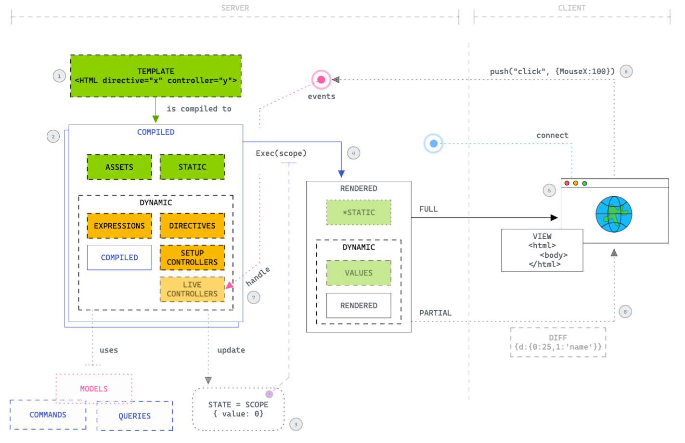
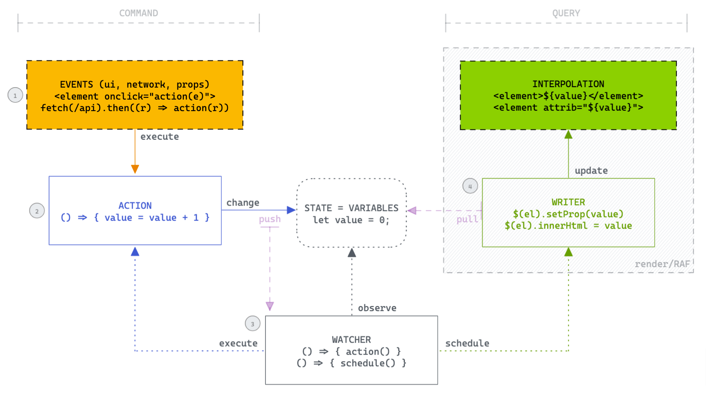
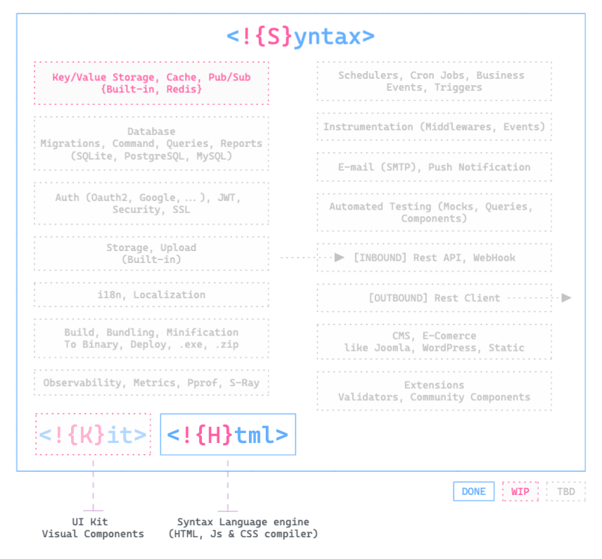

<br>
<div align="center">
    
    <p align="center">
        The ultimate web framework to do amazing things and be productive.
    </p>    
</div>

<br>

[//]: # ([![Build Status]&#40;https://github.com/syntax-framework/syntax/workflows/CI/badge.svg&#41;]&#40;https://github.com/syntax-framework/syntax/actions/workflows/ci.yml&#41; )
[//]: # ([![Documentation]&#40;https://img.shields.io/badge/documentation-gray&#41;]&#40;https://syntax-framework.com&#41;)

## WORK IN PROGRESS

- Declarative, html based
- Components, Directives
- HTML Over the Wire (Phoenix LiveView like, less verbose)
- HTTP2
- No Javascript need (optional, but capable and powerful)
- Standalone (.exe) & Embedded (`go get -u syntax`)

```html
<component 
    name="clock" 
    param-title="string"
    client-param-label="@title"
>
  <h1>{title} server side</h1>    
  <span>${time} - ${label} client side</span>

  <script>  
    let time = new Date();

    const interval = setInterval(() => {
        time = new Date()
    }, 1000)

    export OnDestroy = () => clearInterval(interval)  
  </script>  
</component>  

<clock title="My First Component"/>
```

## Server Side (Golang)



## Client Side (Javascript)




## Features (Roadmap)

List of some ideas that could be explored in the future.



- Key Value Storage
- Cache
- Pub Sub
- Redis Integration
- SQL Database support (SQLite, PostgreSQL, MySQL)
  - Queries
  - Commands
  - Reports
  - Migrations
- Authentication/Authorization
  - JWT 
  - Oauth2 (Google, Instagram, ...)
- Security, SSL
- Storage
  - Upload
- i18n, Localization
- Build/Dev Tools
  - Bundler, Minification
  - Source Maps
  - Binary package (.exe, .bin)
  - Automated testing
    - Mock, Queries, Components
- Observability/APM
  - Metrics
  - Pprof
  - Dashboard
  - S-Ray (zend z-ray like)
- Schedulers, Cron Job
- Business Events, Triggers
- Instrumentation, Middlewares
- E-mail, Push Notification, Web Notification
- Inbound - Rest API, Webhook
- Outbound - Rest Client
- Extensions
  - Validators
  - Components
- CMS/E-Commerce
  - Maybe (as library, full-featured, plug and play)
  - Joomla, WordPress, Static Site generator, ...
